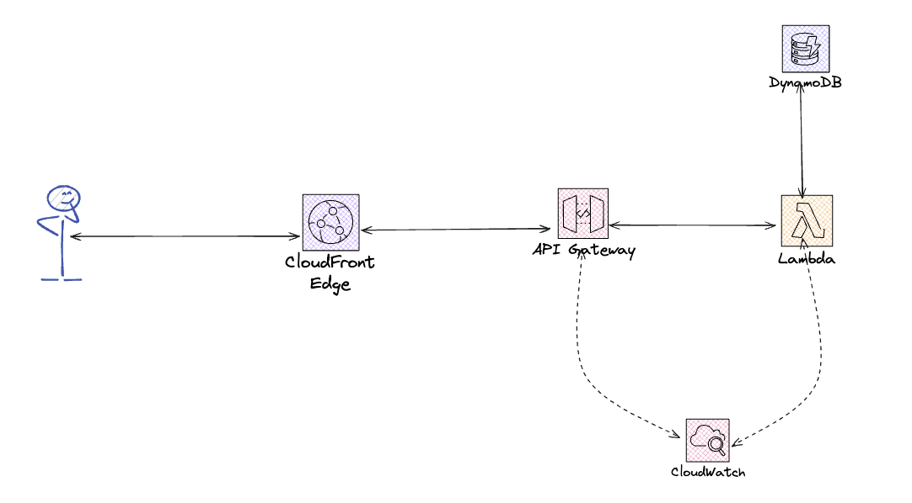
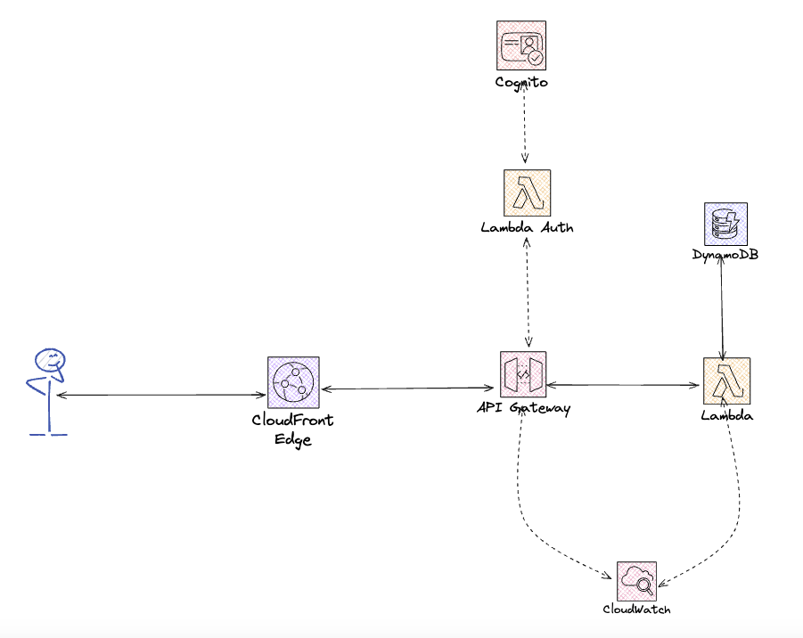
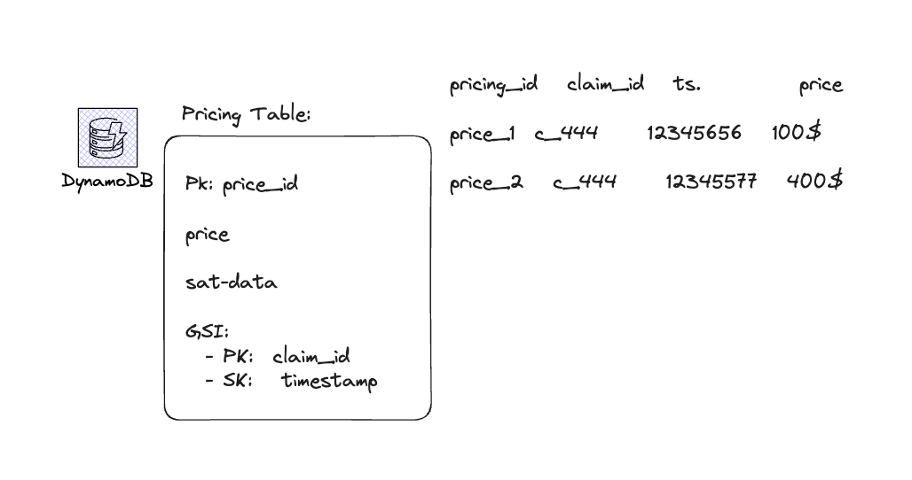
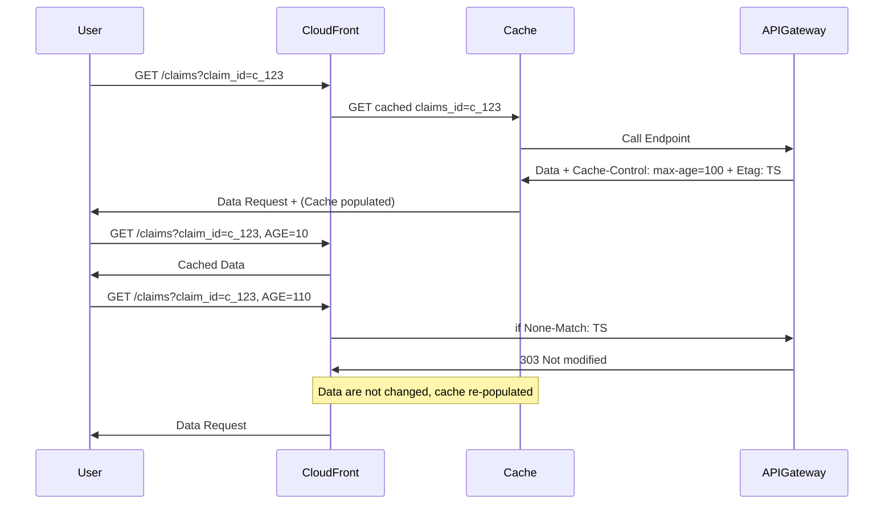

# Problem 

# Solution Demo

<video src="/docs/videos/demo.mov" controls="controls" style="max-width: 730px;">
</video>

## Basic Architecture

### Security 

To grant security we can add lambda auth + cognito

## Data Modelling

## CloudFront Edge Caching Flow

              