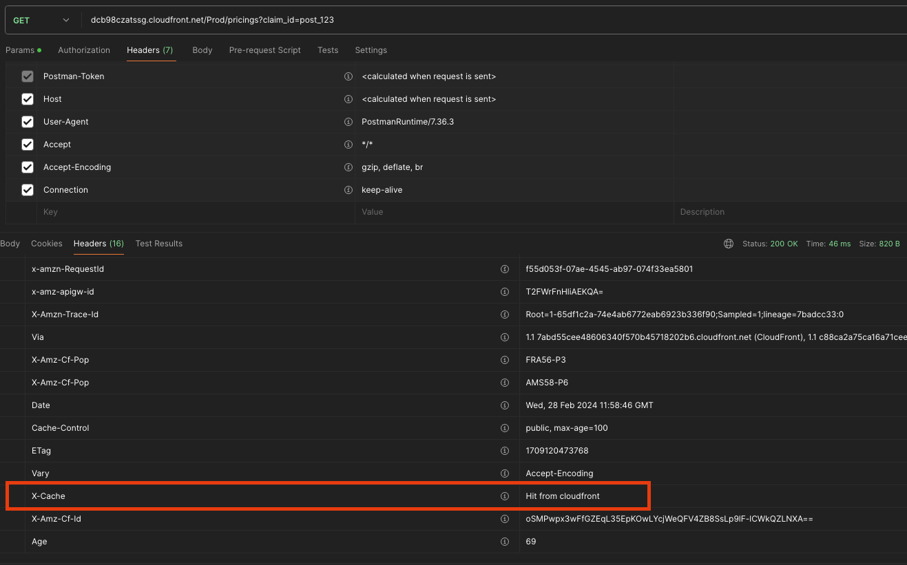
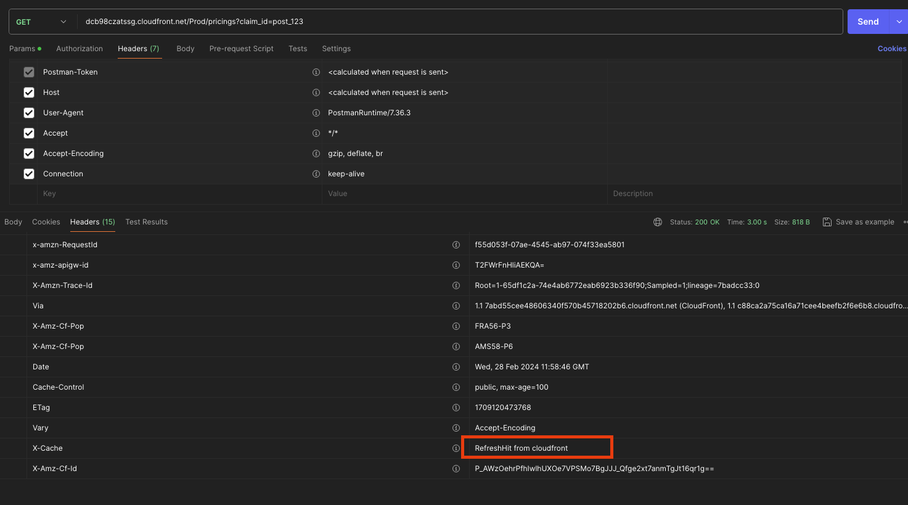
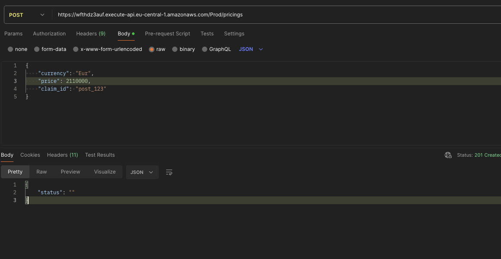
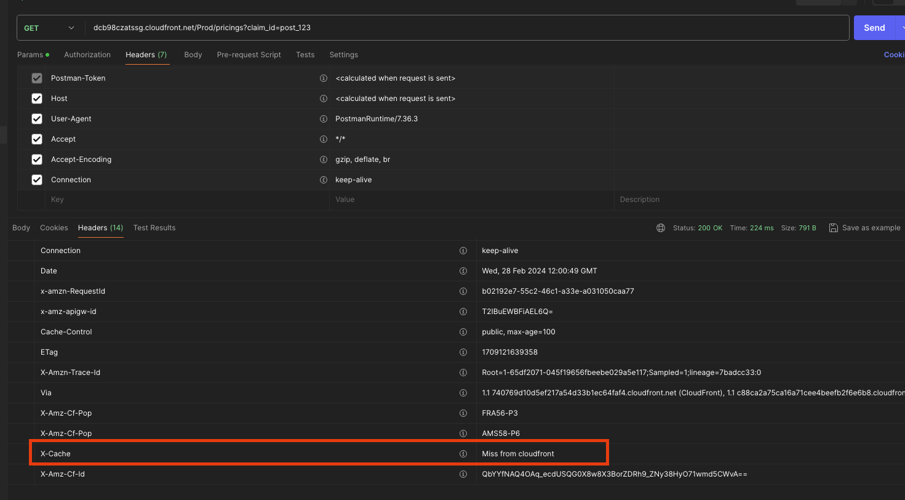
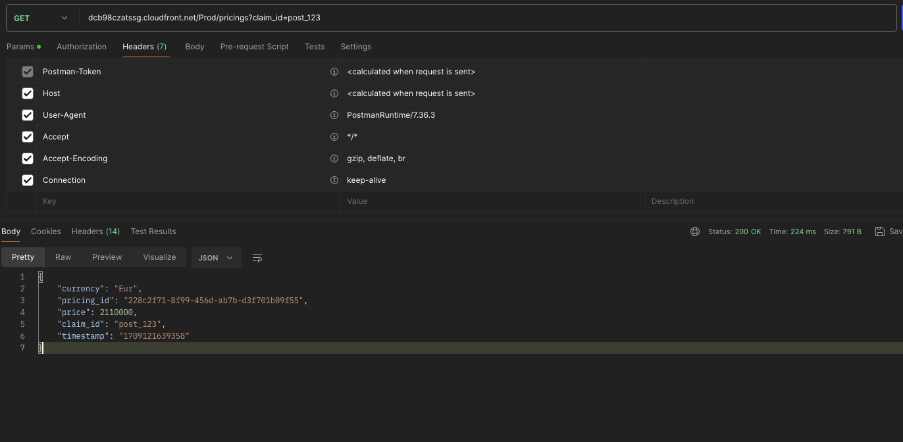
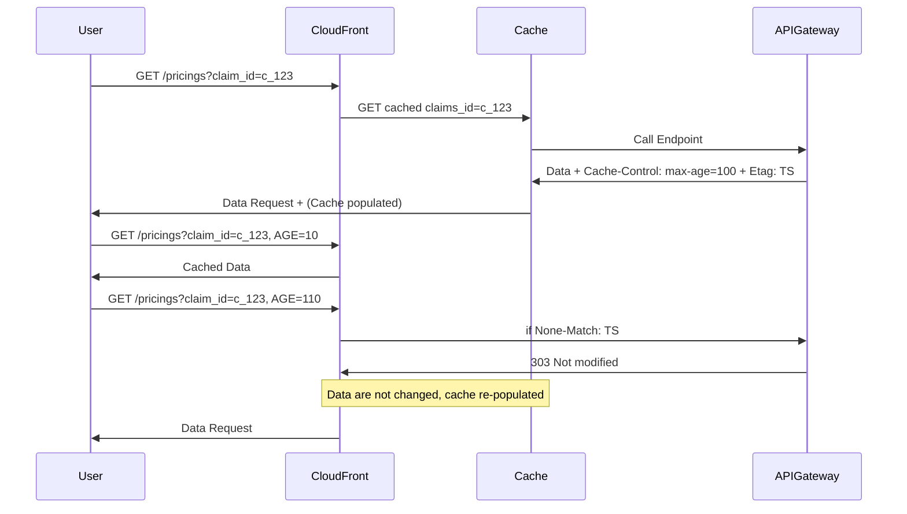

# Problem 

Throughout the day, clients frequently call an endpoint to retrieve the latest pricing offer for a claim. To mitigate the impact of multiple requests and resource consumption, implementing a caching mechanism at the CloudFront level can significantly enhance efficiency.

# Basic Architecture

# Demo:

_(Postman collection in /docs/Caching.postman_collection.json and video.mov)_

Clients call the GET endpoint multiple times to refresh a claim. The max-age is set to 100 seconds, so within the next 100 seconds, the call will hit the cache.

After 100 seconds, the CloudFront cache will forward the call to the API Gateway and Lambda, including the If-None-Match header with the ETag as its value.

If the If-None-Match header has the same value as the last item retrieved in the database, the Lambda will return 303. This indicates that there are no changes in the database, and the cached value remains a refreshed value.

During this process, let's suppose there is an update:

After the max-age period, CloudFront will again include the If-None-Match header. However, this time, the last item in the database has a different timestamp. This signifies that the value in the cache is no longer valid.

## Data Modelling

### Schema Details: 

- PK: price_id
- GSI: 
  - claim_id HASH (PK)
  - timestamp SORT (SK) 

The unique aspect of this index is its capability to query claim_id by retrieving the most recently updated item in the database, facilitated by the timestamp acting as the sort key.

# CloudFront Edge Caching Flow

# What is missing:

As I embark on my inaugural TypeScript project, I am mindful that there may be aspects I overlook or potential mistakes I could make along the way. Your understanding and patience as I navigate through this learning experience are greatly appreciated.

### Missing points [canbe in-progress]:

- Unit / Integrations Tests
- CI/CD 
- More TypeScript Friendly
- Metrics and Logs (API-Gateway, Lambda) [in-progress]
- Improve the SAM template

## Note: Endpoints can have a security control: 

To grant security we can add lambda auth + cognito

              